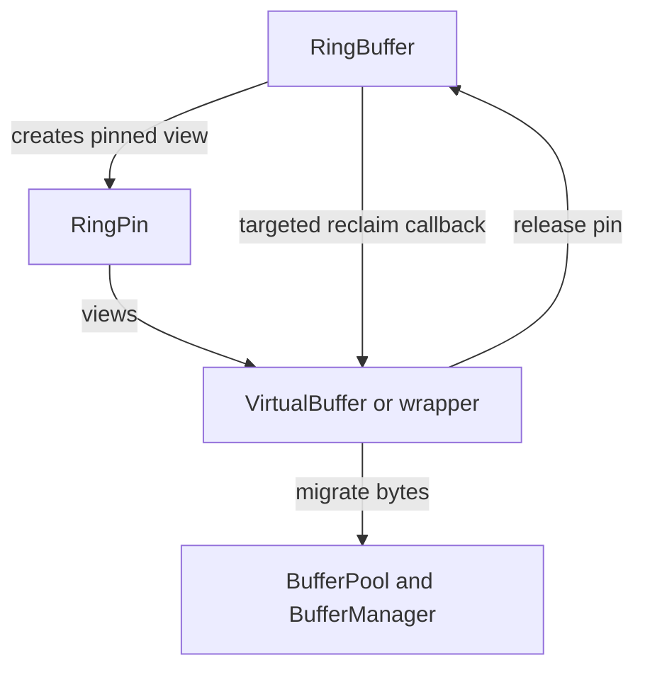

# PolyTransport Project

The high-level goal of the PolyTransport project is to provide a versatile, yet easy-to-use, bidirectional, multi-transport, content-streaming facility with backpressure / flow control.

The initial application will be communication between various parts of JSMAWS (JavaScript Multi-Applet Web Server), applets, and web clients. In this use case, web clients and applets should be considered untrusted (and potentially malicious) users.

It must capable of supporting simple HTTP(s) requests with fixed-length reponses, streaming connections (e.g. media, SSE), and "bidi" (bidirectional) connections, such as WebSockets (with the expectation of adding other transports in the future).

The implementation should make best-effort attempts to prevent mis-behaving or hostile connections from disrupting other users.

## Quick Conceptual Overview

- Endpoints establish one or more transport connections over one or more connection types
- Communications across each transport are divided into one or more distinct channels
  - Each channel may be unidirectional (user data travels only in one direction) or bidirectional (user data travels in both directions)
- A message is application-defined unit of content
  - It which might or might not have an enforced size limit within the transport
- Each message may be split into one or more chunks, the last of which includes an EOM (end-of-message) marker
- Each message has an associated, application-defined message type which is included with each of the message's chunks
- Chunk and message readers may filter by one or more message types
- A backpressure / flow-control system is implemented based on byte-count "credits" at the transport and channel levels
  - Chunks may not be sent until a sufficient credit balance is (or becomes) available
  - Credits are consumed when chunks are sent
  - Credits are restored upon receipt of chunk acknowledgement messages (ACKs) indicating that the chunks have been completely processed by the recipient

## JSMAWS Use Cases

### Transport Methods

- HTTP(S) connections
- "Bidi" (bidirectional connections)
  - Based on WebSockets initially
  - Implementation must be modular to allow addition of other bidi connection types in later phases
- Web worker messages (`postMessage` with bidirectional buffer transfer)
- Pipes (e.g. Deno process IPC via stdin/stdout/stderr)
- "PTOC" (nested, "PolyTransport-Over-Channel")
- Virtual connection (for testing)

### Potential End-Points

- HTTP(S) clients (e.g. browsers)
- JSMAWS operator process
  - Provides request/routing/response coordination
- JSMAWS router processes
  - These are the main threads for router web workers for filesystem-based routing
- JSMAWS router web workers
  - These run in the operator for virtual routing or in router processes for filesystem-based routing
- JSMAWS responder processes
  - These are the main threads that manage applet web workers
- JSMAWS applet web workers
  - These are the (mostly user-supplied) applets that generate responses to requests
  - They are generally untrusted code
  - A bootstrap module loads first to set up the transport and secure the execution environment before loading the actual applet
    - Among other things, the bootstrap removes direct stdin/stdout/stderr access and redirects console.* messages across the transport when active

### Client

- Connection/transport summary
  - Reads: client <--TCP-- operator
  - Reads: client <--PTOC via operator-- applet (for ws)
  - Writes: client --TCP--> operator
  - Writes: client --PTOC via operator--> applet (for ws)
  - Native console and uncaught-exception handling

### Operator

- Connection/transport summary
  - Reads: operator <--TCP/PTOC-- client
  - Reads: operator <--worker/IPC-- router
  - Reads: operator <--IPC/PTOC-- responder
  - Writes: operator --TCP/PTOC--> client
  - Writes: operator --worker/IPC--> router
  - Writes: operator --IPC/PTOC--> responder
  - Console and uncaught-exception messages go to console and/or syslog logger (configurable)

### Responder

- Connection/transport summary
  - Reads: responder <--IPC-- operator
  - Reads: responder <--worker/PTOC-- applet
  - Writes: responder --IPC--> operator
  - Writes: responder --worker/PTOC--> applet
  - Console and uncaught-exception messages are forwarded via the C2C channel to the operator for logging

### Applet

- Connection/transport summary
  - Reads: applet <--worker-- responder
  - Reads: applet <--PTOC via responder-- client (for ws)
  - Writes: applet --worker--> responder
  - Writes: applet --PTOC via responder--> client (for ws)
  - Console and uncaught-exception messages are forwarded via the C2C channel to the responder which forwards them again (to the operator) for logging
- Applets are typically untrusted, user-supplied code
  - The bootstrap module exposes a single, bidirectional transport channel at applet startup
    - This is used to convey the initial request, response type, and some types of response data
  - Applets must not be able to gain direct access to buffers, other channels, or the transport directly or indirectly via this channel
  - For bidirectional connections (e.g. WebSockets) the JSMAWS infrastructure will create a PolyTransport-over-channel connection between the client and the applet (running over the original channel, and relaying through the operator and responder), which the client and applet can channel-ize as they see fit (with the entire PTOC transport subject to the hosting channel's data and message budgets within the parent transport)

## JSMAWS Request Handling

### Initially

- **Operator**
  - Selects responder based on request routing
  - Requests a unique request/response channel over the operator <-> responder transport
  - Accepts the return request for the same channel
  - Accepts atomic or streaming response on the same channel
  - Sends small atomic responses as a single response
  - Sends larger or streaming responses as a streamed response
- **Responder**
  - Accepts req/res-unique operator channel request and requests one back (responder-->operator)
  - Requests responder --write--> applet channel `primary`
  - Requests responder --write--> applet bootstrap channel `bootstrap` (e.g. for applet main module path and environment-lockdown options)
  - Accepts responder <--read-- applet channel `primary`
  - Accepts responder <--read-- applet channel `console`
  - Sends bootstrap parameters on `bootstrap` channel to applet bootstrap module
  - Forwards request on `primary` channel to applet main module
  - Forwards atomic or streaming response to the operator
- **Applet bootstrap module**
  - Requests applet --write--> responder channel `primary`
    - Bootstrap presents this as `self.polyTransportChannel`
  - Requests bootstrap --write--> responder channel `console`
    - Bootstrap uses "console intercept" to implement logging (mostly) transparently
  - Accepts bootstrap <--read-- responder channel `bootstrap` to receive bootstrap parameters
  - Disables or intercepts `self.onmessage` and `self.postMessage`
- **Applet**
  - Receives request on `primary` channel (the only external access it has)
  - Sends an atomic response, begins streaming a response, or agrees to upgrade to bidi (still on `primary` channel)

### Upon WebSocket Bidi Upgrade

- **Operator**
  - Creates a WebSocket PT to communicate with the WS client
  - Creates a channel-hosted PT to communicate with the applet and attaches it to the req/res channel with type `client`
  - Accepts responder's return request
  - Relays between client WS PT and applet PTOC in both directions
- **Responder**
  - Relays `client`-type chunks between operator and applet PTOCs in both directions
- **Applet**
  - Creates a channel-hosted PT to communicate with the client and attaches it to the primary (only accessible) channel with type `client`
  - The client and applet can now communicate over the channel-hosted PolyTransport with the operator and responder relaying chunks (they don't need to worry about message boundaries or storing entire messages, which could be any size, because the protocol handles it)

## Buffer Management

- Primary goal: Attempt to minimize system calls
  - (Expect system-call overhead to typically exceed buffer-copying overhead)
- Secondary goal: Minimize buffer copying when possible
- Manage pools of reusable, resizable buffers
  - Payload sizes: 1K, 4K, 16K, 64K
  - Allow additional 1K for headers, combining ACK blocks, etc
- Auto-detect "BYOB"-mode reader support and use it if available; fall back to default readers if not
- Use a "ring-buffer"-style input buffer for BYOB readers
- Have a `VirtualBuffer` class similar to `TypedArray` buffer views, but capable of both intra and inter-buffer views (possibly based on an array of `Uint8Array`)
  - Example uses
    - A single range for a single chunk from the ring buffer
    - Multiple ranges to assemble a chunk from stream-supplied buffers when BYOB is unavailable
    - Multiple ranges from one or more buffers to assemble a complete message from component chunks
    - Virtual header + data + ACK-block(s) view to copy to a new ArrayBuffer for writing
- Have a `BufferManager` class to track `ArrayBuffer` usage (i.e. which `VirtualBuffers` are referencing the associated `ArrayBuffer`, when it can be released or overwritten, etc)
- Move (copy) ring-buffer content to the most appropriate pool buffer size if/when:
  - Buffer content hasn't been processed when it's time to overwrite the existing buffer content ("slow" reader/processor)
  - Content needs to be moved between contexts (i.e. buffer transfer via `postMessage`)
- `VirtualBuffer` instances should intelligently update when their underlying data moves from one buffer to another (e.g. from a ring-buffer to a pool-buffer)

### Ring-backed VirtualBuffers: pin registry + targeted migration callbacks

The ring buffer is used for high-throughput streaming I/O. To minimize copies, some `VirtualBuffer` instances will be allowed to reference ring-backed byte ranges *directly*.

Since ring buffers reuse storage (wrap-around), the ring must be able to reclaim space without corrupting any live `VirtualBuffer` views.

#### Requirements

- Ring-backed byte ranges that escape the immediate parse/write operation must be **pinned**.
	- Pinning is explicitly reference-counted.
	- Consumers must explicitly indicate when they are finished with pinned views (release).
	- The implementation must not rely on GC-finalization for correctness.

- **Input-ring only:** Ring-backed views are allowed to escape only on the *input* side (slow reads / delayed processing).
	- The output path must avoid long-lived ring-backed views.
	- If a writer cannot complete immediately, it must queue the payload in pool-managed buffers and later copy into the output ring.

- When the ring needs to reclaim space that overlaps pinned data, it must notify holders via **targeted pin callbacks**.
	- The ring maintains a registry of active pin handles, not a broadcast list of listeners.
	- Reclamation includes the specific ring range(s) to be reclaimed.
	- Callback dispatch must be awaitable so reclamation can be coordinated without races.
	- Failure semantics:
		- If any pin holder cannot migrate/release (or throws/rejects), ring reclamation fails and the error must propagate to the owning transport/reader.
		- Default recovery behavior is transport shutdown, since safe forward progress is no longer possible if the ring cannot reclaim space.

- `VirtualBuffer` (or a ring-backed wrapper around it) must listen for reclamation events and **migrate** its referenced bytes out of the ring and into pool-managed buffers when necessary.
  - After migration, the virtual buffer must transparently refer to the new storage.
  - After migration, the ring-backed pin must be released so the ring can reclaim.

#### Proposed model

- **RingBuffer**
	- Maintains an internal record of pinned ranges.
	- Maintains a registry of active pin handles.
	- When reclaiming, it identifies pins overlapping the reclaim ranges and invokes each pin holder directly (awaited), e.g. `await pinHolder.onRingReclaim({ ranges, epoch })`.
	- The reclaim payload includes:
		- `ranges`: one or more `{ start, length }` ring windows that will be overwritten
		- `epoch` (or `cycle`) identifier to disambiguate wrap-around reuse

- **Ring pin handle** (name TBD, e.g. `RingPin`)
	- Returned by the ring when a caller needs a view into ring-backed bytes that must not be overwritten yet.
	- Captures sufficient metadata to test for overlap with reclaim ranges, e.g.:
		- `ring`: owning ring instance
		- `epoch`: wrap-around epoch when the pin was created
		- `start`, `length`: ring index window
	- Provides:
		- `release()` (required)
		- `views` (one or more `Uint8Array` windows; may be split at wrap)
		- `migrate(bufferManager)` to copy bytes into pool storage and release the pin

- **Ring-backed views**
	- A ring-backed `VirtualBuffer` (or a wrapper type that owns it) must register itself as the owner/holder of its `RingPin` handles.
	- When invoked, the holder checks overlap between the reclaim `ranges` and any `RingPin` windows it holds.
	- For each overlapping pin, it calls `pin.migrate(bufferManager)` and replaces the affected virtual-buffer ranges to reference the migrated pool buffer windows.
	- Overlap is computed in ring-index space, with wrap-around handled by treating each pin as one or two windows (split at the ring boundary).
	- `epoch` is used to avoid false overlap when indices repeat across wrap-around reuse.

#### Security invariant (reservations)

- Any ring-backed reservation that is exposed for writing must be either:
  - fully written by the caller (every byte), or
  - pre-zeroed by the reservation owner before exposure,
  to prevent leaking bytes from previous ring iterations.
- Web workers should start with a small initial buffer pool
  - They must be able to request additional buffers from the main thread, up to their configured limits
  - They must be able to send excess buffers back to the main thread
- Senders use up byte count credits when sending
- Senders regain byte count credits when chunks are ACK'd
- Senders and receivers must maintain a running total of available byte credits at the transport and channel levels

## Channels, Chunks, And Messages (Definitions)

- A channel is a data-sub-stream for transmitting message chunks between transports
- Every channel has a unique numeric identifier *for each established direction* across the transport
- Channels may also have string-based names, which are then mapped to their numeric identifiers
- Each transport may set a maximum chunk size (`maxChunkSize` bytes), maximum message size (`maxMessageSize` bytes), and maximum buffer-size credits (`maxBufferSize` bytes) when it agrees to receive channel data (independently for each accepted direction)
  - If the maximum buffer-size credits is non-zero, the sender may send up to that many (over-the-wire) bytes
  - Byte credits are restored as chunks are ACK'd
  - Sending chunks in excess of current buffer-size credits is considered a protocol violation and may result in termination of the channel or connection
  - If the maximum message size is unlimited (0), then either the maximum buffer size must also be unlimited, or the reader must process messages only in streamed chunks and not as entire/complete messages
- A "message" is simply a sequence of one or more "chunks", terminating with a chunk with its "EOM" (end-of-message) marker set
- Each message has an associated, application-defined "message type"
  - Message types may be numeric, or *directionally-registered* strings
  - The message type is included with each message chunk
  - Chunk and message readers may filter by message type
- Each transport must track local (accept) and remote (request) ids for named channels
  - The "on-the-wire" channel id for data is the receiving transport's id for the channel (the one returned when a channel request is accepted)
    - This is the remote channel id for the data sender and the local channel id for the data receiver
  - The "on-the-wire" channel id for ACKs is the *sending* transport's id (the same id as the data being ACK'd, as the original data receiver is the ACK sender)
    - This is the local channel id for the ACK sender and the remote channel id for the ACK receiver
- Each channel must track local and remote ids for named message types
  - The "on-the-wire" message-type id is the receiving transport's id for the message type (the one returned by the remote transport in response to a local `addMessageType`)
  - On the receiving end, `newChunk` channel events can look for a corresponding matching local message-type

## Channel State Transitions

- Local reader state:
  - `closed` -> `open` -> `closing` -> {`localClosing`, `remoteClosing`} -> `closed` (back to start)
  - `closed` -> `rejected` (locally, permanent final state)
- Local writer state:
  - `closed` -> `requested` -> `open` -> `closing` -> {`localClosing`, `remoteClosing`} -> `closed` (back to start)
  - `closed` -> `requested` -> `rejected` (remotely, permanent final state)
- Closed channels may repeat the request/accept cycle as long as they haven't been rejected
- State `localClosing`: remote signaled done but local side still closing
- State `remoteClosing`: local side done but remote has not yet signaled done
- `beforeClosing` event is triggered (on both peers) at entry to `closing` state and includes local `direction` property (`read` or `write`)
- `closed` event is triggered (on both peers) at return to `closed` state and includes local `direction`
- Closure-related events are triggered separately for each direction

## Events

- Events are handled with the `addEventListener` and `removeEventListener` model
- Event dispatches must `await` handler execution
- Some events support a `event.preventDefault` action
- The transport `outofBandData` event is triggered if out-of-band data is detected
  - The runtime environment is expected to intercept console traffic and uncaught exceptions and route them over the console-content channel (C2C) if they would log to the transport pathway, but some messages may be sent before the binary transport stream is initiated; this event is used to handle that traffic
  - The event includes the out-of-band data
- The transport `newChannel` event is triggered when the remote transport requests a channel
  - A handler may call `event.accept(options = {})` to establish the channel
    - This returns a local channel object, which can be used to register event handlers
    - The following options set the limits of what the local transport is willing to accept; they are included in the reply to the requestor
      - `maxBufferSize`: max buffer size (byte count); 0 = unlimited
      - `maxChunkSize`: max size (bytes) of a single chunk; 0 = none (but transport-level limit always applies)
      - `maxMessageSize`: max size (bytes) of an individual message; 0 = unlimited
    - The following is used to control when ACKs start flowing back to the sender in response to data
      - `lowBufferSize`: buffer size low-water mark
  - All registered handlers will be called, but only the first to accept has any affect (any additional `.accept` is silently ignored)
  - If no handler accepts the channel request, it will be rejected by default
  - Either way, the response is not sent to the requestor until all dispatched handlers have completed
  - A channel request is always a request *to send*
  - A `.accept` is an agreement *to receive* subject to specific terms (i.e. limits; see "max"-series of settings)
  - A channel is always "read/write" at the *transport level* (ACKs must flow in the opposite direction of data)
  - A channel is considered *unidirectional (because data can only flow in one direction)* if one transport has requested it and the other has accepted
    - At the *channel level*, it appears to be "write-only" on the "request" side (this side cannot receive data) and "read-only" on the "accept" side (this side cannot send data)
  - A channel is considered *bidirectional (because data can flow in both directions)* if both transports have requested and both have accepted
- The channel `newMessageType` event is called when the remote requests a message-type-name-to-id mapping
  - The mapping will be added unless any handler calls `.preventDefault()`
- The `beforeClosing` event is triggered before a channel or transport is closed
- The `closed` event is triggered after a channel or transport has closed
- Event order when the transport is closing:
  1. Transport `beforeClosing`
  2. Each channel `beforeClosing`
  3. Each channel `closed`
  4. Transport `closed`
- The `newChunk` channel event is triggered whenever a new chunk is received for the channel from the remote transport
  - The chunk must be available as an `event` property
  - This event can be used for debugging, validation, and/or "push" processing
  - If a handler deems a message to be invalid, it may close the channel, close the transport, or send its own message to the sender (if the channel is bidirectional)

## PTOCs

- Each channel may host any number of PTOC (PolyTransport-over-channel) connections
- Each PTOC is assigned a unique numeric message type (or previously mapped string message type) upon attachment to the host channel
- The PTOC wraps its out-bound traffic in data messages at the host-channel level using the assigned message type
- The PTOC listens for arriving chunks with its associated message type and unwraps that in-bound traffic
- `beforeClosing` and `closed` listeners should be added to the hosting channel as part of PTOC attachment in order to propagate the events
- Since transports require bidirectional communication (e.g. for sending ACKs in response to data), PTOCs *must* be hosted on *bidirectional* channels

## Partial Interface Specification

- Transport constructors should accept a `{ logger }` option for logging (`logger.debug`, `.info`, `.warn`, `.error`)
  - If not provided, the default should fall back to `console` operations
- `addEventListener` and `removeEventListener` to manage event handlers (transports and channels)
- `transport.setChannelDefaults(options = {})` takes the same options as `event.accept` for new channel requests, and provides the default values to be used if they are omitted upon `.accept`
  - Note: It does not eliminate the need to call `.accept` in order to accept channel requests
- `transport.start` allows the transport to start reading and writing.
  - At least one `newChannel` handler should be in place first to avoid all channel requests being rejected
- (transport) `async close ({ discard, timeout })`
  - Closes all open channels on the transport and stops reading and writing; resolves when done or rejects on error or timeout
  - Waits for current communications to finish unless `discard` is truthy.
- (channel) `clear({ chunk, direction, only })`
  - Clears chunks (or a specific chunk) from the queue
  - `chunk` a specific in-bound chunk-sequence-number to remove
  - `direction: 'read'` clears in-bound chunks
  - `direction: 'write'` clears out-bound chunks
  - Default is both directions
  - `only` allows chunk targeting by message type
- (channel) `async close ({ direction, discard, timeout })`
  - Closes (all or part of) a channel and resolves after writes have flushed or rejects upon error
  - If `direction` is `read`, the local transport will no longer accept data from the remote transport
    - Essentially, terminates the local `event.accept` of a remote channel request
  - If `direction` is `write`, the local transport will no longer sent data to the remote transport
    - Essentially, terminates the local `transport.requestChannel`
  - Any other value for `direction` (including none) closes the channel in both directions
    - This works as if each direction were closed separately, but back-to-back, and in no particular order
  - If `discard` is truthy:
    - Closing the `read` direction discards any unprocessed chunks in the receive buffer
    - Closing the `write` direction discards any chunks waiting to be sent
- `async transport.requestChannel (idOrName, { timeout })` attempts to establish a new channel with the receiving party by sending a `chanReq` message; returns a promise.
  - If any receiver transport handler calls `event.accept(options = {})`, the receiver will send a `chanReqAcc` (accept) message with receiver's terms (limits) and the numeric id the receiver expects the sender to use for the channel
    - NOTE: Channel ids are assigned by the *accepting side*, as there's no point in reserving one unless the request is accepted, and multiple requests could potentially be in-flight at once (a scenario in which several ids would need to be reserved, with the possibility that some might be used and others not)
  - Otherwise, the receiver transport will send a `chanReqRej` (reject) message
  - The promise will resolve with a channel instance object if the channel is established, or reject otherwise
- `async channel.addMessageType (type)`
  - Sends a channel-control message registering the string-based message type in the local-to-remote direction
  - The returned promise resolves when the remote transport responds with a message including the numeric message type it expects the sender to use for the string type (thus confirming it will be able to recognize the type)
  - Both sides must perform this action for string types that will be sent in both directions
  - Just as for numeric channel ids, it is perfectly normal for the assigned numeric code to be different in each direction
- `async channel.write (type, data, { eom=true })`
  - If the channel is open, waits for sufficient buffer-size credits as required and then queues the data
  - Resolves upon completion of queueing or rejects upon error
  - `type`: app-defined message type (numeric or pre-registered string)
  - `data`: a data chunk to send
  - `eom`: (end of message) indicates this write is the final write of the current message
- Channel reader methods:
  - Each waits until the required amount of data is available (or the timer (msec) times out or the channel closes)
  - `async readChunk ({ timeout, only })` resolves to meta-data and a virtual buffer containing the next matching chunk
    - The meta-data includes the message type (`.type`) and EOM status (`.eom`)
  - `readChunkSync ({ only })` works like `readChunk` except that it returns `null` if a matching chunk isn't immediately available
  - `async readMessage ({ timeout, only })` resolves to meta-data and a virtual buffer containing the (remainder of the) next matching message
    - The meta-data includes the message type (`.type`)
    - Users should be cautious about mixing `readChunk` and `readMessage` calls, as `readMessage` will only return the remainder of a message if `readChunk` calls have already returned one or more initial, non-EOM chunks
  - `readMessageSync ({ only })` works like `readMessage` except that it returns `null` if a matching message isn't immediately available
  - If `only` is included, only chunks/messages of the specified message types are returned
    - It may be a single string or number, an array, or a Set
- `readMessage` and `readMessageSync` must throw an `UnsupportedOperation` exception when called (user must read chunks instead) if:
  - `maxBufferSize` is non-zero (limited) AND:
    - `maxMessageSize` is zero (unlimited) or `maxBufferSize` is less than twice `maxMessageSize`

# Data Management Strategy - Version 3

## Byte-Stream Transport Connection Establishment

- Child processes and their workers in transport-over-IPC scenarios should make arrangements to intercept stdin / stdout / stderr, console output, and uncaught exceptions and redirect these over the console-content channel when open
- Send the transport handshake after any out-of-band-data capture-and-redirection is ready

1. Transport-identifier `\x02PolyTransport\x03` (15B) (not needed/not included for PTOC)
  - `[2, 80, 111, 108, 121, 84, 114, 97, 110, 115, 112, 111, 114, 116, 3]`
2. Transport-configuration (JSON) `\x02{"...}\x03` (variable length)
  - `[2, 123, 34, ..., 125, 3]`
3. Switch to binary stream `\x01` (`[1]`, 1B)

## Transport Configuration

- `c2cEnabled=false`: controls whether C2C (console-content channel) is enabled
- `c2cMaxBuffer`: optional maximum C2C buffer size
- `c2cMaxCount`: optional maximum C2C message count
- `minChannelId=256`: the minimum auto-assigned channel id
- `minMessageTypeId=1024`: the minimum auto-assigned message-type id
- `version=1`: the transport protocol version (for future extensions)

## Byte-Stream Message Types (First Byte)

(After switching to binary stream)

- 0: ACK message
- 1: Channel control message \[earlier version incorrectly said type 2\]
- 2: Channel data message \[earlier version incorrectly said type 3\]

### General Notes

- Remaining header/message size
  - Additional bytes to follow = this value * 2 + 2
  - Pad the header if an odd number or < 2 bytes would otherwise be required

## Byte-Stream ACK Message

### Notes

- ACK messages are handled directly by the transport
- ~~There is no ACK / reply / backpressure / flow-control for ACK messages~~
- To prevent DoS attacks, it is a protocol violation to ACK and the same channel chunk more than once
  - It triggers transport-level, possibly followed by channel-level, `protocolViolation` events with reason `Duplicate ACK`
  - The transport is closed unless the transport-level event does `.preventDefault()`
  - The channel-level event is triggered if the transport-level event does not result in shutting down the transport.
    - The channel is closed unless the channel-level event does `.preventDefault()`
- As ACKs must work even for unidirectional, named channels, their channel number is always the locally assigned channel number, not the remote one (which wouldn't exist in this case) used for data messages

### Format

- 1B: 0 (ACK type)
- 1B: remaining message size
- 2B: flags
  - None defined at this time
- 4B: transport **local** channel number
- 4B: base **remote** sequence number
  - The base sequence is the starting point for interpreting the include/skip ranges.
  - It is **not required** to be the lowest unacknowledged sequence number; receivers may choose a base that minimizes skip ranges.
- 1B: range count (0-255)
  - Alternating (up to range-count, e.g. 3 -> include - skip - include):
  - 1B (even offsets): Include quantity (0-255)
  - 1B (odd offsets): Skip quantity (0-255)
- Never includes a data segment

## Byte-Stream Channel-Control And Channel-Data Headers

### Notes

- The headers of channel-control messages and channel-data messages are structurally equivalent except for the type-byte
- Channel-control messages are interpreted by the transport
  - They are used for post-channel-creation channel administration (e.g. for message-type id assignment)
  - They count toward the channel's message and byte budgets just like channel-data messages
  - As such, they are also ACK'd like channel-data messages
- Channel-data messages are used for user (application) data transmission

### Format

- 1B: 1 (channel-control type) or 2 (channel-data type)
- 1B: remaining header size
- 4B: total data size (bytes)
- 2B: flags
  - +1: EOM (last chunk in current message)
- 4B: remote transport channel number (name-to-id mapping per transport and direction)
- 4B: local channel sequence number (per channel and direction)
- 2B: remote message type (name-to-type mapping per channel and direction)
- Total: 18 bytes
- Followed by data segment if data-segment size > 0

## Transport-Control Channel (TCC)

- Permanent **channel 0** (opens and closes with the transport)
- TCC pre-defined message types
- **0**: transport state-changes
- **1**: new-channel requests
- **2**: new-channel responses (accept/reject)
  - When a transport accepts a channel request, it includes its local channel id in the response
    - This is the channel id the requesting transport should use when sending to the accepting transport and the one that will be used in returning ACKs
	- *The same channel might have a different id in the other direction*
	- This allows for simple sequential channel id assignment as channels are accepted
	- It also avoids channel id negotiation, as they're set independently in each direction

## Console-Content Channel (C2C)

- Permanent, writable **channel 1** opens and closes with the transport *if the remote peer offers `c2cEnabled: true` in the handshake configuration*
- This channel id is reserved (regardless of whether or not the channel is activated)
- Since console communications are critical but can interfere with transport messages, the transport supports this reserved console-content channel, with activation of the channel linked directly to transport activation (bypassing the normal channel request/accept protocol)
- C2C pre-defined message types
  - **0**: uncaught-exception messages
  - **1**: `debug`-level messages
  - **2**: `info/log`-level messages
  - **3**: `warn`-level messages
  - **4**: `error`-level messages

## Channel Control Messages

- CCM pre-defined message types
- **0**: channel-message-type registration request
  - Registers a message-type string, requesting receiver's message-type id
  - `async channel.addMessageType(type)` returns a promise that resolves when registration of string `type` across the transport has completed and may be used for out-going messages; numeric message types may also be used (without registration)
  - Initial default:
    - Types 0-1023 are reserved for pre-agreed (unregistered) types; auto-assignment begins at 1024 (transport configurable)
- **1**: channel-message-type registration response
  - Response with message-type id assigned to message-type string

## Buffer Pools

- Pools of resizable `ArrayBuffer`
- Payload sizes: 1KB, 4KB, 16KB, 64KB
- Additional for overhead (header, ACKs on send, etc): + 1K each
- Allocate below low-water mark
- "Eased" release above high-water mark
- Workers
  - Separate low and high-water marks
  - Request additional from main thread when below low-water mark
  - Send excess to main thread when above high-water mark

## I/O Strategies (Based On JSMAWS Use Cases)

- Byte-stream reading
  - Read into a reusable 64K buffer for maximum possible input per read syscall
  - Parse into JavaScript objects (for the header) and copy to appropriately sized ArrayBuffer (for the data)
- Byte-stream writing
  - Leave room for header (currently 18B) at start of buffer
  - Append data to buffer
  - Append ready ACK blocks to buffer as space permits
- `postMessage` reading/writing
  - Pass header as standard JS object (via cloning)
  - Pass data in ArrayBuffer (via transfer)
- Allows objects with proper boundaries to pass between threads

## Proposed `VirtualBuffer` Class

Purpose: Minimize copying by creating a virtual buffer composed of actual buffer content.

Like a `TypedArray` view of an `ArrayBuffer`, but able to represent both partial and cross-buffer views.

## Update 2025-12-29-A

Most of what's been implemented so far is not useful.

The encoders in protocol.esm.js currently allocate their own buffers, which defeats the purposes of using ring buffers and buffer pools:
- Minimal copies
- Minimum system calls

Input ring buffers:
- Everything configurable
- Default 256K total size (?)
- Preferred read = min(64K, distance to end of buffer)
- If the preferred read < 16K, abandon the remainder of the ring and move the write head back to the start of the ring (due to decreasing data-per-read efficiency)
- If there's yet-to-be-processed data within the preferred-read zone (PRZ) from prior ring activity, migrate chunks from the PRZ into pool buffers
  - The VirtualBuffer instances for this data must automatically and transparently update to reference the new storage
- Data bound for web-workers must also be migrated out of the ring, since the main ring must not be transferred to a web worker via `postMessage`

Output ring buffers:
- Everything configurable
- Default 256K total size (?)
- If any ACKs are ready to be sent, wait for room, if necessary, and then construct them (directly in the ring)
- If there is data pending, wait for room, if necessary
  - If all the data (with header) will fit into the remaining buffer, add it
  - If there is at least 16K remaining in the buffer, add as much as will fit
  - Move back to the start of the ring to add the rest

Output from web workers should be consolidated into the output ring.

It is expected that header information will be encoded and decoded in the main thread and passed to/accepted from web workers as objects (only data transferred directly as array buffers).

### Buffer Pool

- Managed in the main thread
- Pre-allocates minimum buffers and adds additional as required/based on demand
- Releases excess buffers over time
- Transfers (filled and empty) buffers to/from workers via `postMessage`

## Updates & Clarifications 2026-01-02-A

- Change `readChunk` and `readChunkSync` to be simply `read` and `readSync`
- There will be no `readMessage`, `readMessageSync`, or `writeMessage`, at least for now
- `write` must automatically chunk writes that exceed the chunk limit
- For now, `maxMessageSize` is strictly informational, and not used to enforce anything
- A filtered (`{ only }`) read must not impact (i.e. cancel/reject) any other filtered reads
- Typed messages are like "light-weight channels" within channels
  - Due to type-based filtering, chunks may be read/released/ACK'd out of sequence
- Individual chunks must be written atomically (with their headers), but "large writes" need not be
  - E.g. two types A and B writing 128K might write A(64K#1), B(64K#1), A(64K#2), B(64K#2) or any other order
- Transports and channels have corresponding max chunk and max buffer limits
  - Channel limits may not exceed transport limits
  - Writes must fit within both the transport sending budget and the channel sending budget

## Updates & Clarifications 2026-01-03-A

- ~~It's the user's responsibility to make sure there aren't conflicting readers.~~ Specifically, behavior is undefined if:
  - Readers exist concurrently with overlapping "only" sets
  - Filtered readers and unfiltered readers are present at the same time

### Waiting For Sending Budget

- First, make sure the channel has sending budget (also makes sure the channel isn't dead-locked)
- Second, make sure the transport has sending budget in FIFO order for round-robin queueing of ready channels
  - Can use `TaskQueue` for this
  - `import { TaskQueue } from '@task-queue';`
  - See `resources/task-queue/src/task-queue.esm.js` for interface details.

## Updates & Clarifications 2026-01-03-B

- Users need to be able to write "directly" to the ring buffer ("zero-copy"/VirtualBuffer-style, potentially split around the end of the ring)
  - This will require a separate `VirtualRWBuffer` ("read/write") sub-class of `VirtualBuffer` that supports `set`, `fill`, and possibly other "write-related" methods
- Sending and receiving text-based (e.g. JSON) data is likely going to be a **very common** use case
  - `channel.write` should support string data and encode it automatically using `encoder.encodeInto`
    - This implies that we will need to be able to over-allocate a reservation (e.g. worst-case encoded length = string length * 3) and release any unused length
  - For decoding, include a `vb.decode({ start=0, end=length, label='utf-8', fatal=false, ignoreBOM=false })` method for minimizing copies on the read side
    - Combines slice-like range selection with text decoding in a single operation
    - **Single-segment optimization**: Zero-copy decode directly from buffer
    - **Multi-segment optimization**: Uses streaming `TextDecoder` with `stream: true` option to process segments without intermediate copy
    - Streaming decoder correctly handles multi-byte UTF-8 sequences split across segment boundaries
    - Parameters match `TextDecoder` options for consistency
    - Performance: 4-5x faster than copy-first approach for multi-segment buffers

## Updates & Clarifications 2026-01-04-A

### Sizes, Reservations, ACKs

- For better clarity, "size" items should be renamed to "bytes" (where applicable), e.g. `maxChunkSize` should be renamed `maxChunkBytes`
- Define `MAX_DATA_HEADER_BYTES` as 18 (current value based on bytestream data format)
- Define `MIN_DATA_RES_BYTES` as 4
- Require `maxChunkBytes >= MAX_DATA_HEADER_BYTES + MIN_DATA_RES_BYTES`
- `maxChunkBytes` is the **"over-the-wire"** size limit (header + data payload)
- All data chunking must be based on `maxDataBytes = maxChunkBytes - MAX_DATA_HEADER_BYTES`
- Define `RESERVE_ACK_BYTES` as 514 (current maximum header/ACK bytes)
- ACKs have a channel field (required for sequence number context), but they are *transport-level* messages, not channel-level messages
- ACK handling:
  - As transport-level messages, ACKs require transport-level budget, but **not** channel-level budget
  - Ready ACKs should be batched (using the range + skip encoding)
  - Ready ACKs must be sent before ready data
- If data is ready but no ACKs are ready, the *transport* reservation should require `RESERVE_ACK_BYTES` more byte budget than required by the data alone to prevent data from blocking potentially-critical ACKs
- The buffer-pool manager should operate on a relative-demand basis (as opposed to fixed maximums)
- Ring-to-pool data migration failures likely represent unrecoverable memory allocation issues
  - This is considered a fatal condition, and results in closing the *entire transport*
- Total buffer demand is expected to be application-managed via configuration settings (e.g. `maxBufferBytes`) and avoidance of unrestricted channel acceptance
- Buffer sizes (including ring-buffer sizes and pool sizes), etc *should all be configurable* unless they represent format-specific details (like header sizes)

### Managing (Number Of) Channels And Message Types

- Trusted clients should use the `newChannel` and `newMessageType` events to detect malicious/errant/unexpected use and shut down problematic channels or transports accordingly

### Buffer Pin Management

- Channel reading should include two pin management options
  - Manual release for "advanced" use (e.g. chunk aggregation, with pin release after processing the final chunk)
  - `.readSyncAndRelease((chunk) => ...)` and `.readAndRelease(async (chunk) => ...)` helper methods that release the pin after their callbacks complete

### Timeout Handling

- `requestChannel`
  - Rejects (locally) with `TimeoutError`
  - Regardless of reason, a late (or otherwise "unsolicited") `chanReqAcc` should trigger a `chanNoReq` TCC reply message to the accepting transport to indicate there's no (longer any) active request
  - `chanNoReq` must trigger an implied (directional) channel auto-close on the accepting transport
- `read`
  - Reject with `TimeoutError`
  - Unlike `readSync`, `null` here implies EOF
- `close`
  - Force-close if "orderly" close times out

### Duplicate Reader Detection/Prevention

- (Detect and) prevent duplicate channel readers
  - Create a meta object for each reader, to include a `stale` flag (initially false)
  - Keep a scalar for unfiltered async readers and a map for filtered scalar readers
  - If there is already a non-stale unfiltered reader (in the scalar) and *any* other read is attempted, reject the new reader with a `DuplicateReaderError`
  - If the new reader is filtered, attempt to register the reader for each of its message types
    - If there is a *non-stale* reader already registered for the type
      - Immediately mark the new reader stale (automatically invalidating any prior type registrations without any other action)
      - Reject the new reader with `DuplicateReaderError`
    - If there is no registered reader or the existing reader is stale, set the new reader as the registered reader for the type
- When a reader is activated in response to a new chunk, set the meta state to stale (invalidating all current registrations with this single action)
  - The reader must initiate a new read (creating a new meta object) to read another chunk

### Channel Rejection

- Channel rejection only directly affects the requested direction
- It is up to the rejected requestor to explicitly close any previously established reverse direction if desired

### Channel And Message-Type Exhaustion/Reuse

- Channel ids are 32 bits and message-type ids are 16 bits, offering a large range of ids
- Configuration parameters should be readable (but not modifiable) by user code
- To be clear, `minChannelId` and `minMessageTypeId` are the minimim ids where *mapping* begins, not the minimum usable
- Channel state (including name-mappings) is maintained for the life of the transport
  - If a named channel is closed and re-opened (in the same direction), it must be assigned the same channel id
  - Channel ids are never reassigned to a different name
- New name mappings must never be assigned active channel ids
- Named-message-type mappings are retained for the life of the channel direction
  - Mappings restart fresh ("clean slate") for a direction that has closed and reopened
  - Re-requesting an existing mapping (within a direction that has not closed) returns the existing message-type id
- Numeric-only message-types do not require any state storage
  - It is therefore not always possible to determine whether a particular message-type id is "active"
  - If an application needs to use more than the initial 1024 unmapped numeric ids on a channel, it should manage its own mapping (if desired) and not use any PolyTransport-managed mapping on the channel
- Any other semantics / mapping / reuse strategies are by endpoint (e.g. client/application) agreement, not a function of PolyTransport
